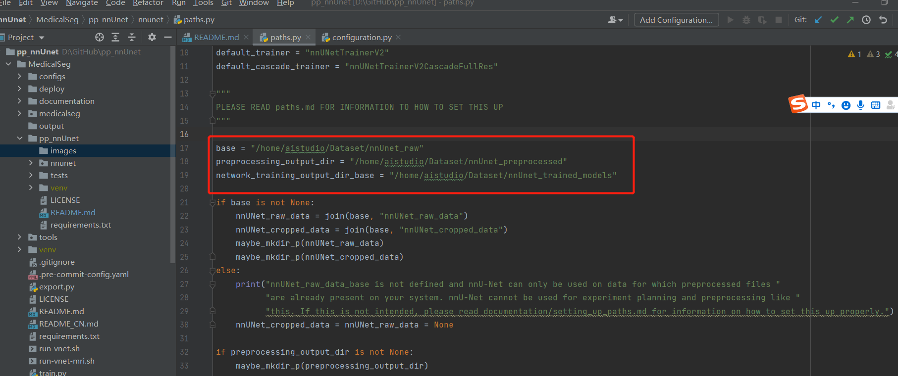

# AI-Studio-nnUnet论文复现


## 项目描述
> Unet模型自从2015年提出以来，在医学图像分割领域一直占据着举足轻重的地位。
> 我们知道医学图像有很多是基于3d的，所以后来也有学者提出了3dunet模型。
> 但是对于深度学习来说超参的控制一直影响着模型最终的一个结果。
> nnUnet这篇论文并没有提出新的模型，而是在unet模型基础上根据图像数据的spacing信息和尺寸信息形成了一套能够自适应的调参工具。
> nnUnet工具在许多医学领域的比赛上取得了很不错的成绩。


**论文：**

- [nnU-Net: Self-adapting Framework for U-Net-Based Medical Image Segmentation](https://arxiv.org/abs/1809.10486)

**项目参考：**
- [https://github.com/MIC-DKFZ/nnUNet](https://github.com/MIC-DKFZ/nnUNet)


## 快速开始
### 第一步：克隆本项目
#### git clone https://github.com/YellowLight021/pp_nnUnet
#### cd MedicalSeg 
#### cd pp_nnUnet/nnunet

```
-batchgenerators  用于数据增强的包
-dataset_cnversion 用于将数据转化为nnunet能够识别的结构
-evaluation    用于evaluation的包
-experiment_planning 用于生成实验计划的包
-inference    用于结果推演的包
-network_architecture  用于根据plan文件生成对应网络模型的包
-postprocessing 用于后处理
-preprocessing 用于刚开始数据规整比如crop等操作
-run  训练代码入口处
-training  用于训练的一些基本配置，比如数据加载和损失函数构建等
-utilities  一些辅助性功能的代码
-configuration 基础的配置
-paths.py  用于设置关键路径的，这里对刚开始使用nnunet框架的人比较重要，下面会详细介绍
```
## 第二步：安装pp_nnUnet下的必要第三方库
pip install -r requirements.txt

## 第三步：准备工作
[MSD-Lung ](https://drive.google.com/drive/folders/1HqEgzS8BV2c7xYNrZdEAnrHk7osJJ–2) 

1、下载解压数据集到你觉得合适的位置。（如解压到f盘，数据集就是F:\Task05_Prostate）

2、建立一个文件夹Dataset。在该文件夹下在建立nnUNet_preprocessed、nnUNet_raw、nnUNet_trained_models文件夹

3、在如上建立的nnUNet_raw文件夹下面在建立nnUNet_cropped_data、nnUNet_raw_data两个文件夹

## 第四步：数据格式转换

1、配置路径信息，将paths.py文件中的路径改成，刚刚新建Dataset文件夹的对应路径。如图  

2、cd 到experiment_planning文件夹下。

3、执行命令：python nnUNet_convert_decathlon_task.py -i F:\Task06_Lung（这个是你解压数据集的位置）

4、执行成功后，刚刚建立的Dataset\nnUnet_raw\nnUNet_raw_data文件夹下应该出现了Task006_Lung文件夹。

## 第五步：训练计划制定以及preprocessing

1、还是在到experiment_planning文件夹下。

2、执行命令：python nnUNet_plan_and_preprocess.py -t 6

3、执行成功后，Dataset\nnUnet_raw\nnUNet_preprocessed下应该出现Task006_Lung文件夹。

## 第六步：模型训练

1、需要cd到run文件夹下。

2、2d模式unet训练命令：python run_training.py 2d nnUNetTrainerV2 6 all -c --npz

3、3dlower模型unet训练：python run_training.py 3d_lowres nnUNetTrainerV2 6 all

4、3DUnet-cascade模型训练：python run_training.py 3d_cascade_fullres nnUNetTrainerV2CascadeFullRes 6 all --npz

5、注意训练3DUnet-cascade模型时候必须要先训练3dlower，3dlower训练完成后会输出predict的文件作为cascade的补充输入。

6、unet2d模型训练了70个epoch超过paper中的指标（读者可以自己更改在模型训练的回合数training\network_training文件夹下的nnUnetTrainerV2.py中更改self.max_num_epochs）

7、unet3dlower训练了55个epoch，然后cascade模型训练了60个epoch超过paper中的指标（可以更改training\network_training中nnUnetTrainerV2.py和nnUNetTrainerV2_CascadeFullRes.py中self.max_num_epochs参数）

8、模型的训练日志都放在log文件夹下了。模型参数的链接：链接：https://pan.baidu.com/s/1yeVGV8dcXc4-GdoaCu6Wwg 
提取码：nm5d 
--来自百度网盘超级会员V6的分享

## 第七步：模型inference

1、需要cd到inference文件夹下。

2、进行3d_cascade_fullres的inference：python predict_simple.py -i Dataset/nnUnet_raw/nnUNet_raw_data/Task006_Lung/imagesTs -o imagesTs_infer_cascade -t 6 -m 3d_cascade_fullres -f all -z

3、也可以进行2d模式的inference：python predict_simple.py -i Dataset/nnUnet_raw/nnUNet_raw_data/Task006_Lung/imagesTs -o imagesTs_infer_2d -t 6 -m 2d -f all -z

4、对3d_cascade_fullres和2d的预测结果进行ensemble，执行命令：python ensemble_predictions.py -f imagesTs_infer_2d imagesTs_infer_cascade -o ensemble_2d_cascade_infer


## 在AI Studio上[运行本项目](项目“nnUnet调试”共享链接(有效期三天)：https://aistudio.baidu.com/studio/project/partial/verify/3874882/2506bf5003b64facb015a538c99142f2) 
1、fork项目后按照markdown提示按照顺序自行运行


